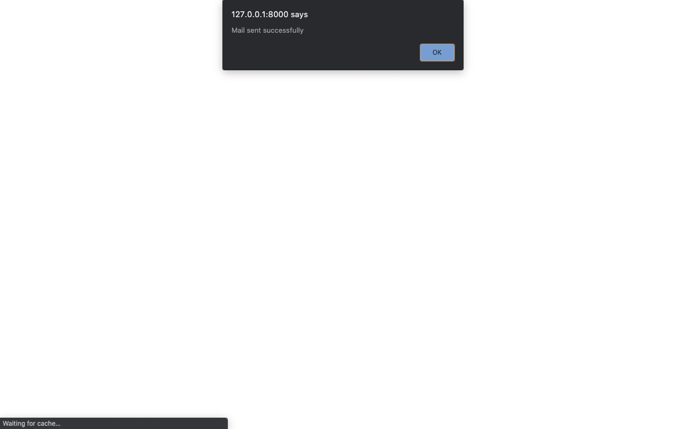

# spam_mail_detection

<b>This Django project is made using machine learning classification model. This project detects whether mail is spam or not.</b>

---
### Mail is not spam

***
### Happy face

### You can download the dataset from this link
https://drive.google.com/drive/folders/1CYdHnuiDPMtgYfe18XSf5FJTNB5Ar_gt?usp=sharing
