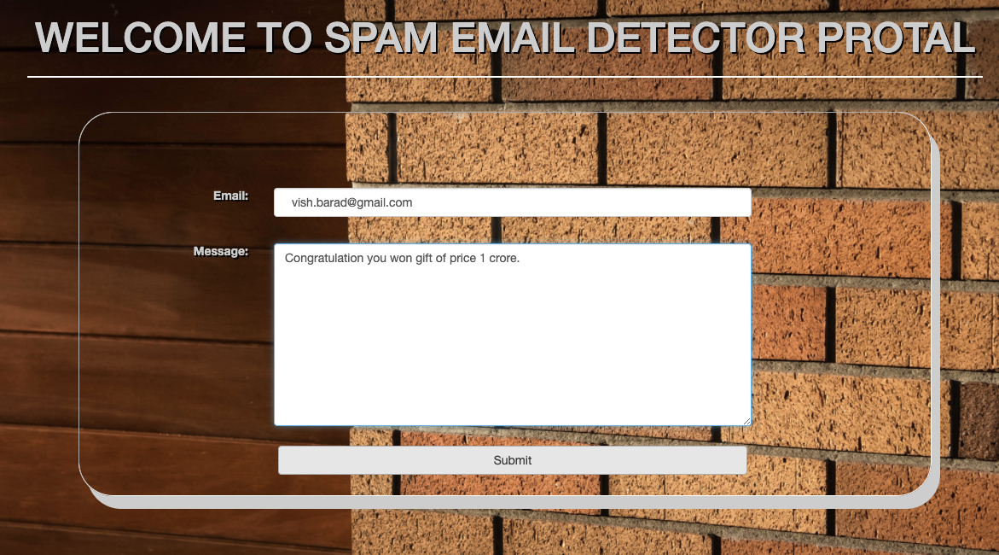

# spam_mail_detection

<b>This project is made using Django framework and machine learning classification algorithm (Naive bayes algo). This project detects whether mail is spam or not.</b>

## Screenshoots of project
---
### Mail is not spam:
--------------------

***
### Mail is not spam:
--------------------

