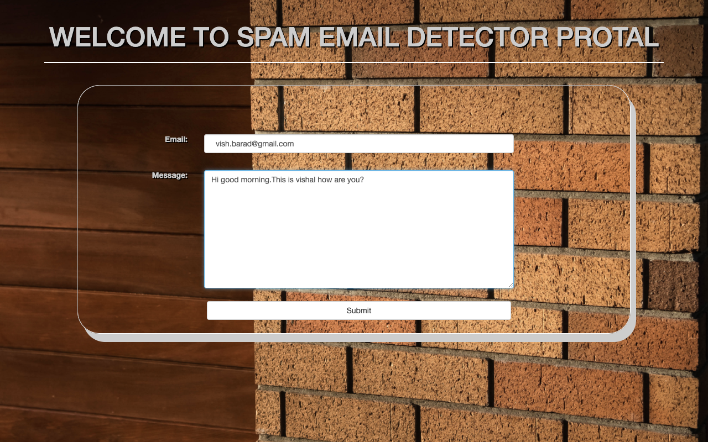
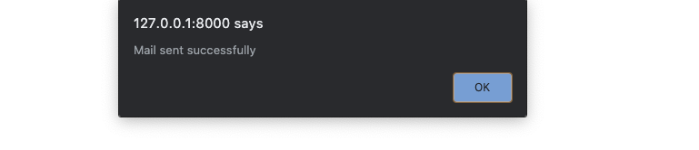
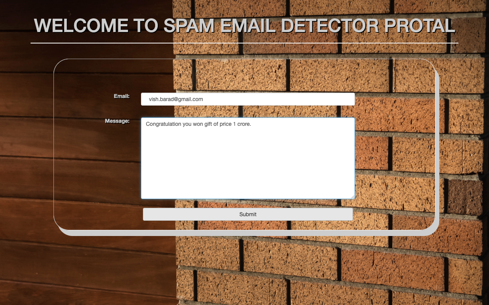
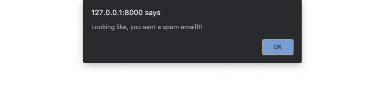

# spam_mail_detection

<b>This Django project is made using machine learning classification model. This project detects whether mail is spam or not.</b>

---
### Mail is not spam

***
### Mail is not spam

